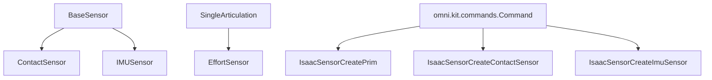

# Overview

```{deprecated} 6.0.0
This extension is deprecated in favor of `isaacsim.sensors.experimental.physics`.
```

`**isaacsim.sensors.physics**` provides Python APIs for physics-based sensor simulation, including contact sensing, IMU readings, and joint effort measurement. It lets you create sensor prims in a USD stage, configure their sampling behavior, and read simulation data from physics-enabled objects. The main use cases are detecting contact forces, measuring inertial motion, and monitoring effort on articulated joints.

<div align="center">



</div>

## Concepts

### Sensor timing

{class}`ContactSensor <isaacsim.sensors.physics.ContactSensor>` and {class}`IMUSensor <isaacsim.sensors.physics.IMUSensor>` support either `frequency` or `dt` to control sampling. These options are mutually exclusive, so use only one when constructing the sensor.

```python
from isaacsim.sensors.physics import IMUSensor

imu = IMUSensor(
    prim_path="/World/Robot/imu",
    name="imu_sensor",
    frequency=60,
)
```

Use `frequency` when you want readings in Hz. Use `dt` when you want to specify the exact sensor period in seconds.

### Physics requirements

{class}`ContactSensor <isaacsim.sensors.physics.ContactSensor>` must be attached to a prim that has `UsdPhysics.CollisionAPI` enabled. Contact sensing depends on physics collision data, so the parent prim must participate in collision reporting.

{class}`IMUSensor <isaacsim.sensors.physics.IMUSensor>` reads simulated linear acceleration, angular velocity, and orientation from a physics body. When creating a new IMU prim without an explicit `dt`, a `PhysicsScene` must exist on the stage.

### Frame data

Sensor readings are returned as frame dictionaries. These frames include simulation timing information such as `time` and `physics_step`, along with sensor-specific values.

For example, `IMUSensor.get_current_frame()` returns linear acceleration, angular velocity, orientation, and validity state. `ContactSensor.get_current_frame()` returns contact state, force, number of contacts, and optionally raw contact entries.

## Functionality

### Contact sensing

{class}`ContactSensor <isaacsim.sensors.physics.ContactSensor>` detects physical contact and reports contact force data. It supports configurable force thresholds and a detection radius.

Key capabilities include:

- Detect whether the sensor is currently in contact.
- Read the current contact force magnitude.
- Configure minimum and maximum force thresholds.
- Configure the sensor detection radius.
- Optionally include raw contact data such as contact points, normals, and impulses.
- Pause and resume data collection.

```python
from isaacsim.sensors.physics import ContactSensor

contact_sensor = ContactSensor(
    prim_path="/World/Object/contact_sensor",
    name="contact_sensor",
    frequency=60,
    min_threshold=0.1,
    max_threshold=100000.0,
    radius=-1.0,
)

contact_sensor.initialize()

frame = contact_sensor.get_current_frame()
print(frame["in_contact"])
print(frame["force"])
```

To include detailed contact data in the frame:

```python
contact_sensor.add_raw_contact_data_to_frame()
frame = contact_sensor.get_current_frame()

contacts = frame.get("contacts", [])
for contact in contacts:
    print(contact)
```

### IMU sensing

{class}`IMUSensor <isaacsim.sensors.physics.IMUSensor>` measures inertial data from a simulated body. It provides three-axis linear acceleration, three-axis angular velocity, and orientation as a quaternion in scalar-first order.

The sensor also supports moving average filter sizes for each measurement type:

- `linear_acceleration_filter_size`
- `angular_velocity_filter_size`
- `orientation_filter_size`

```python
from isaacsim.sensors.physics import IMUSensor

imu_sensor = IMUSensor(
    prim_path="/World/Robot/imu_sensor",
    name="imu_sensor",
    dt=1.0 / 120.0,
    linear_acceleration_filter_size=4,
    angular_velocity_filter_size=4,
    orientation_filter_size=1,
)

imu_sensor.initialize()

frame = imu_sensor.get_current_frame(read_gravity=True)
print(frame["lin_acc"])
print(frame["ang_vel"])
print(frame["orientation"])
```

Use `read_gravity=False` when you want linear acceleration without gravity included.

### Effort sensing

{class}`EffortSensor <isaacsim.sensors.physics.EffortSensor>` measures joint effort for an articulated body. The `prim_path` should point to a joint under an articulation, for example `"/World/Robot/joint_name"`.

The sensor stores readings in buffers and can return either the latest value or an interpolated value based on the configured `sensor_period`.

```python
from isaacsim.sensors.physics import EffortSensor

effort_sensor = EffortSensor(
    prim_path="/World/Robot/arm_joint",
    sensor_period=1.0 / 60.0,
    use_latest_data=False,
    enabled=True,
)

reading = effort_sensor.get_sensor_reading()
print(reading.is_valid)
print(reading.time)
print(reading.value)
```

{class}`EsSensorReading <isaacsim.sensors.physics.EsSensorReading>` is the data container returned by {class}`EffortSensor <isaacsim.sensors.physics.EffortSensor>`. It contains:

- `is_valid`: Whether the reading is valid.
- `time`: Simulation time for the reading.
- `value`: Measured effort value.

## Key Components

### {class}`ContactSensor <isaacsim.sensors.physics.ContactSensor>`

{class}`ContactSensor <isaacsim.sensors.physics.ContactSensor>` is the high-level runtime API for contact force sensing. It is used after a contact sensor prim exists or is created at the requested path.

Common operations include:

- `get_current_frame()` to read contact state and force data.
- `set_frequency()` and `set_dt()` to change sampling.
- `set_radius()` to change detection radius.
- `set_min_threshold()` and `set_max_threshold()` to filter contact forces.
- `pause()`, `resume()`, and `is_paused()` to control collection.

### {class}`IMUSensor <isaacsim.sensors.physics.IMUSensor>`

{class}`IMUSensor <isaacsim.sensors.physics.IMUSensor>` is the high-level runtime API for inertial measurements. It reads linear acceleration, angular velocity, and orientation from simulation.

Common operations include:

- `get_current_frame(read_gravity=True)` to read IMU data.
- `set_frequency()` and `set_dt()` to change sampling.
- `pause()`, `resume()`, and `is_paused()` to control collection.

### {class}`EffortSensor <isaacsim.sensors.physics.EffortSensor>`

{class}`EffortSensor <isaacsim.sensors.physics.EffortSensor>` measures effort on a selected degree of freedom in an articulation. It derives from `SingleArticulation`, which reflects that effort readings are tied to articulated-body state.

Useful methods include:

- `get_sensor_reading()` to retrieve the current effort reading.
- `update_dof_name()` to change which joint degree of freedom is monitored.
- `change_buffer_size()` to resize internal reading buffers.
- `lerp()` for linear interpolation between effort values.

### Sensor creation commands

The module also exposes command classes for creating sensor prims in the stage:

- {class}`IsaacSensorCreatePrim <isaacsim.sensors.physics.IsaacSensorCreatePrim>`
- {class}`IsaacSensorCreateContactSensor <isaacsim.sensors.physics.IsaacSensorCreateContactSensor>`
- {class}`IsaacSensorCreateImuSensor <isaacsim.sensors.physics.IsaacSensorCreateImuSensor>`

These classes derive from `**omni.kit.commands.Command**`, so they follow the Kit command pattern with `do()` and `undo()` methods.

{class}`IsaacSensorCreateContactSensor <isaacsim.sensors.physics.IsaacSensorCreateContactSensor>` creates a contact sensor prim and applies the PhysX Contact Report API to the parent prim. {class}`IsaacSensorCreateImuSensor <isaacsim.sensors.physics.IsaacSensorCreateImuSensor>` creates an IMU sensor prim with configurable sensor period, transform, and filter sizes.

```python
import omni.kit.commands
from pxr import Gf

omni.kit.commands.execute(
    "IsaacSensorCreateImuSensor",
    path="/Imu_Sensor",
    parent="/World/Robot",
    sensor_period=1.0 / 60.0,
    translation=Gf.Vec3d(0.0, 0.0, 0.0),
    orientation=Gf.Quatd(1.0, 0.0, 0.0, 0.0),
    linear_acceleration_filter_size=1,
    angular_velocity_filter_size=1,
    orientation_filter_size=1,
)
```

## Relationships

{class}`ContactSensor <isaacsim.sensors.physics.ContactSensor>` and {class}`IMUSensor <isaacsim.sensors.physics.IMUSensor>` inherit from `BaseSensor` in `**isaacsim.core.api.sensors.base_sensor**`, so they follow the same general sensor pattern for initialization, frame access, and pause/resume control.

{class}`EffortSensor <isaacsim.sensors.physics.EffortSensor>` inherits from `SingleArticulation` from `**isaacsim.core.prims**`, because it reads effort from an articulated body joint. It also manages physics and timeline callbacks to keep effort readings synchronized with simulation steps.

The sensor creation APIs use `**omni.kit.commands.Command**`, allowing sensor prim creation to participate in the command system. The command arguments use `pxr.Gf` vector and quaternion types for translation, orientation, radius visualization color, and other stage-facing values.

The extension is backed by a Carbonite C++ plugin and a `_sensor` Python binding module. The plugin exposes the `ContactSensorInterface` and `ImuSensorInterface` interfaces that {class}`ContactSensor <isaacsim.sensors.physics.ContactSensor>` and {class}`IMUSensor <isaacsim.sensors.physics.IMUSensor>` acquire to read simulated sensor data.
